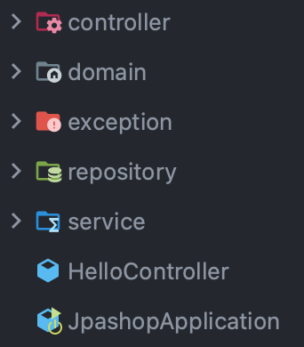

## 계층형 아키텍처와 DAO & DTO, 그리고 Spring MVC

DAO와 DTO에 대해만 다뤄보려 했지만 계층형 아키텍처 개념 정도는 알아야 할 것 같아 가볍게 다뤄보고자 한다.

 

### 계층형 아키텍처란?
- 변경이 일어나면 불필요한 부분의 변경까지 일어나는 것을 방지해주고 빠른 수정을 위해 계층을 나눈것.

과거 JSP만으로 앱을 작성한다면 한 코드에 DB도 접근하고 뷰도 그려주고, 업무 로직도 짜는 등 어지러웠다.
이렇게 작성한다면 변경이 생겼을 때 대응하기 매우매우 어렵다. 코드가 1000줄이 넘어간다고 생각하면..아찔하다.
Network 7 Layer를 생각해보면 같은 맥락으로 나눠놨다고 보면 된다.

 

### 3계층 아키텍처
전통적으로 계층형 아키텍처에서는 3계층으로 구분한다. 물론 반드시 3계층으로 설계할 필요는 없다. 경우에 따라 전통적인 3계층 방식이 아닌 다른 구분 방법을 선택하기도 한다.

3계층 아키텍처는 백엔드의 DB나 레거시 시스템과 연동하는 인터페이스 역할을 하는 데이터 엑세스 계층, 비즈니스 로직을 담고 있는 서비스 계층, 웹 기반의 UI를 만들어내고 관리하는 프레젠테이션 계층으로 구분한다.

#### 퍼시스턴스 계층(데이터 엑세스 계층)
- 데이터 엑세스 계층이라고도 한다. DB 외에 ERP, 레거시 시스템, 메인 프레임 등에 접근하기 때문에 EIS 계층이라고도 한다.
- 그치만 주된 목적은 데이터 저장을 목적으로 하는 DB 이용이 주된 책임이다.
- 영속성은 엔티티를 영구 저장하는 환경을 의미함

#### 서비스 계층
- 비즈니스 계층이라고도 한다. 퍼시스턴스 계층을 호출해 데이터를 가져오고 활용하여 만들어진다.
- 스프링 어플리케이션의 서비스 계층 클래스는 이상적인 POJO로 작성된다.
>POJO란?
> - Plain Old Java Object로 자바로 생성하는 순수한 객체를 의미함.

#### 프레젠테이션 계층
- 가장 복잡한 계층. 매우 다양한 기술과 프레임워크의 조합을 가질 수 있다.
- 유저 인터페이스나 브라우저 커뮤니케이션 로직에 대해 다룬다.
- 애플리케이션 요청을 받아 처리하며 처리된 결과를 사용자에게 보여주는 계층이다.

참고로 Spring MVC는 여기서 프레젠테이션 계층에 해당한다.

 

### MVC패턴
MVC 패턴에 대해서도 간단히 알고 있는 것이 좋을 것같다.

#### Model
- 애플리케이션의 데이터로 모든 데이터의 정보를 가지고 있는 컴포넌트이다.

#### View
- 시각적인 UI, 클라이언트에게 보여지는 화면

#### Controller
- model과 view를 연결해주는 역할.

 

### DAO, DTO, VO

#### DAO(Data Access Object)
- DB를 사용해 데이터에 접근하는 객체
- 실제로 DB에 접근하여 데이터를 얻어내는 객체
- 퍼시스턴스 계층의 구현체

#### DTO(Data Transfer Object)
- 계층간 데이터를 전달하는 객체
- getter/setter 외에 로직이 불필요함
- setter가 없으면 불면

#### VO(Value Object)
- 값 자체를 표현
- getter/setter 외의 로직을 가질 수 있음

 

### Model도 DTO 아닌가 그럼...도메인도 DTO..?

MVC에서는 보통 클라이언트와 Controller 사이에는 DTO를 통해 주고받고, 내부에서는 Domain(혹은 Model)을 통해 주고받는다.
DTO를 사용하면 노출이 되면 안되는 정보는 숨겨야한다. ex)password  
그러면 Domain에 노출해도 되는 정보만 있다면 굳이 DTO로 바꾸지 않고 Domain을 넘겨주면 안되나?

 

### DTO와 Domain을 분리해야하는 이유
위에서 말한 3계층으로 나누는 이유는 SoC(관심사의 분리) 때문이다. 여기서 DTO는 오직 데이터를 전달하는 목적으로 프레젠테이션 계층에 속하고,
Domain은 비즈니스 계층에 속한다. 따라서 분리해줘야 변경에 유연하게 대처할 수 있다.

 

### 그러면 repository랑 DAO랑 같은거네요?
- Spring MVC에서는 repository를 DAO라고 보는 의견도 있는 것 같은 DAO는 data persistence의 추상화이고 repository는 collection of objects의 추상화라고 한다.
- DAO는 데이터베이스와 관련이 많으며 테이블 중심이다.
- Repository는 도메인과 관련이 많으며 Aggregate Root만 다룬다.
- Repository는 여러 DAO로 구현될 수 있는데 그 역은 불가. -> DAO가 더 유연하다고 볼 수 있음
>aggregate root란?  
>- aggregate는 시스템이 기대하는 책임을 수행하면서 일관성을 유지하는 단위, 명령을 수행하기 위해 조회하고 업데이트 해야 하는 최소 단위  
>- 도메인 규칙을 지키려면 애그리거트에 속한 모든 객체가 정상적인 상태를 가져야 하는데, 이 전체를 일관적인 상태로 관리하는 책임을 지는 엔티티이다.

 

사실 이렇게 얘기해도 repository랑 DAO의 차이점을 느끼긴 힘들다. 그냥 차이가 있기는 있구나 정도로 넘어간다.

참고자료: https://eocoding.tistory.com/36, https://bbbicb.tistory.com/44, https://ss-o.tistory.com/160, https://e-una.tistory.com/72#1.2.%20DTO%20%EC%99%80%20Domain%20%EC%9D%84%20%EB%B6%84%EB%A6%AC%ED%95%98%EB%8A%94%20%EC%9D%B4%EC%9C%A0
